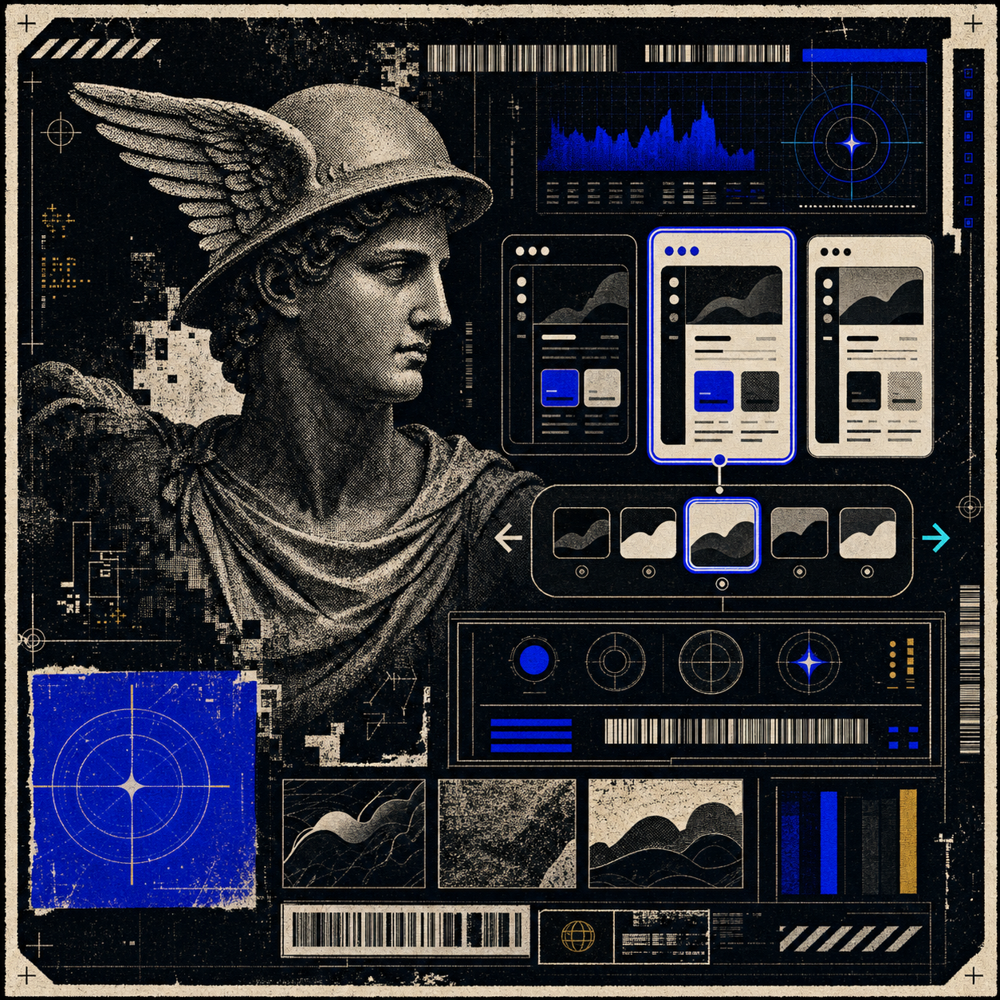
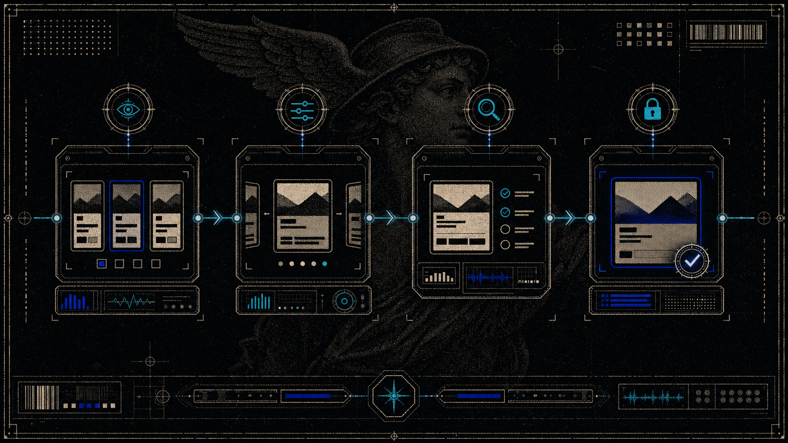

<p align="center">
  
</p>

# Compicker

Compicker is an open source Codex skill for comparing visual and UI alternatives inside the actual product before committing to one direction. It was made by [@cobi_bean](https://twitter.com/cobi_bean).

Instead of judging screenshots in isolation, Compicker asks the agent to build a temporary in-product picker, wire each option to the exact visual layer being compared, verify the variants in browser, then remove the picker once a winner is chosen.

## Why

Visual decisions are easy to fake when options are floating in a mockup. Compicker keeps the decision in context:

- backgrounds are judged behind the real content
- cards are judged next to adjacent cards
- copy treatments are judged in the real hierarchy
- hover and active states are checked where people will actually click
- temporary picker code gets removed during the lock-in pass

<p align="center">
  
</p>

## Install

Copy this repository into your Codex skills directory:

```bash
mkdir -p ~/.codex/skills
git clone <repo-url> ~/.codex/skills/compicker
```

Then call it from Codex with:

```text
$compicker
```

You can also invoke it naturally:

```text
Use compicker to compare these hero backgrounds in the app.
```

## What It Does

Compicker guides an agent through a narrow, product-aware workflow:

1. Identify what is being compared.
2. Find the current implementation and local variant sources.
3. Build the smallest useful temporary picker in the real UI.
4. Wire variants to the exact layer being compared.
5. Verify every option by clicking through it in browser.
6. Recommend the strongest option and explain the tradeoffs.
7. When the user chooses, lock the winner and remove temporary code.

<p align="center">
  
</p>

## Good Use Cases

- compare landing page hero images
- compare page or section backgrounds
- compare card treatments
- compare product screenshots or media crops
- compare copy/layout variants
- compare hover, selected, or active states
- make a review picker for 3 to 7 UI directions

## Picker Pattern

For React or Next apps, Compicker prefers a tiny client component with local state, `aria-pressed`, and a stable `data-*` attribute or CSS variable on the relevant parent:

```tsx
"use client";

import { useEffect, useState } from "react";

export function Compicker({
  options,
}: {
  options: Array<{ id: string; label: string }>;
}) {
  const [selected, setSelected] = useState(options[0]?.id ?? "");

  useEffect(() => {
    document
      .querySelector<HTMLElement>("[data-compicker-scope]")
      ?.setAttribute("data-compicker", selected);
  }, [selected]);

  return options.map((option) => (
    <button
      aria-pressed={selected === option.id}
      key={option.id}
      onClick={() => setSelected(option.id)}
      type="button"
    >
      {option.label}
    </button>
  ));
}
```

For static HTML/CSS prototypes, radios plus `:checked` or `:has()` can work when the target browser supports them and the selected state is visibly reliable.

<p align="center">
  
</p>

## Lock-In Pass

Compicker is intentionally temporary. Once a winner is chosen, the agent should:

- replace dynamic picker state with the chosen static value
- remove picker markup, component files, styles, imports, and references
- restore spacing that only existed to fit the picker
- keep useful permanent variables, tokens, or asset choices
- re-run checks and mention any remaining pre-existing warnings

<p align="center">
  
</p>

## Repository Layout

```text
.
├── SKILL.md
├── agents/
│   └── openai.yaml
├── assets/
│   └── readme/
├── CONTRIBUTING.md
├── LICENSE
└── README.md
```

## GitHub Description

```text
Open source Codex skill by @cobi_bean for building temporary in-product pickers to compare UI variants, choose a winner, and remove the picker cleanly.
```

## License

MIT
